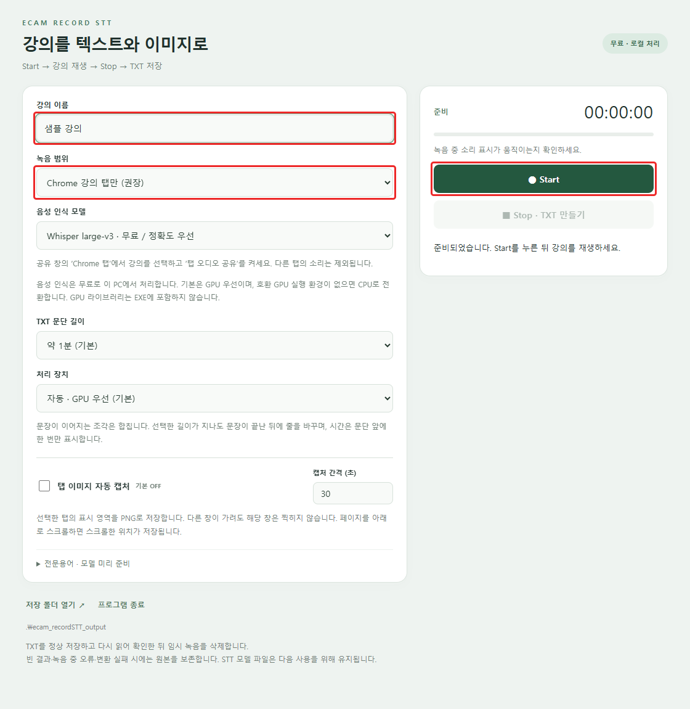
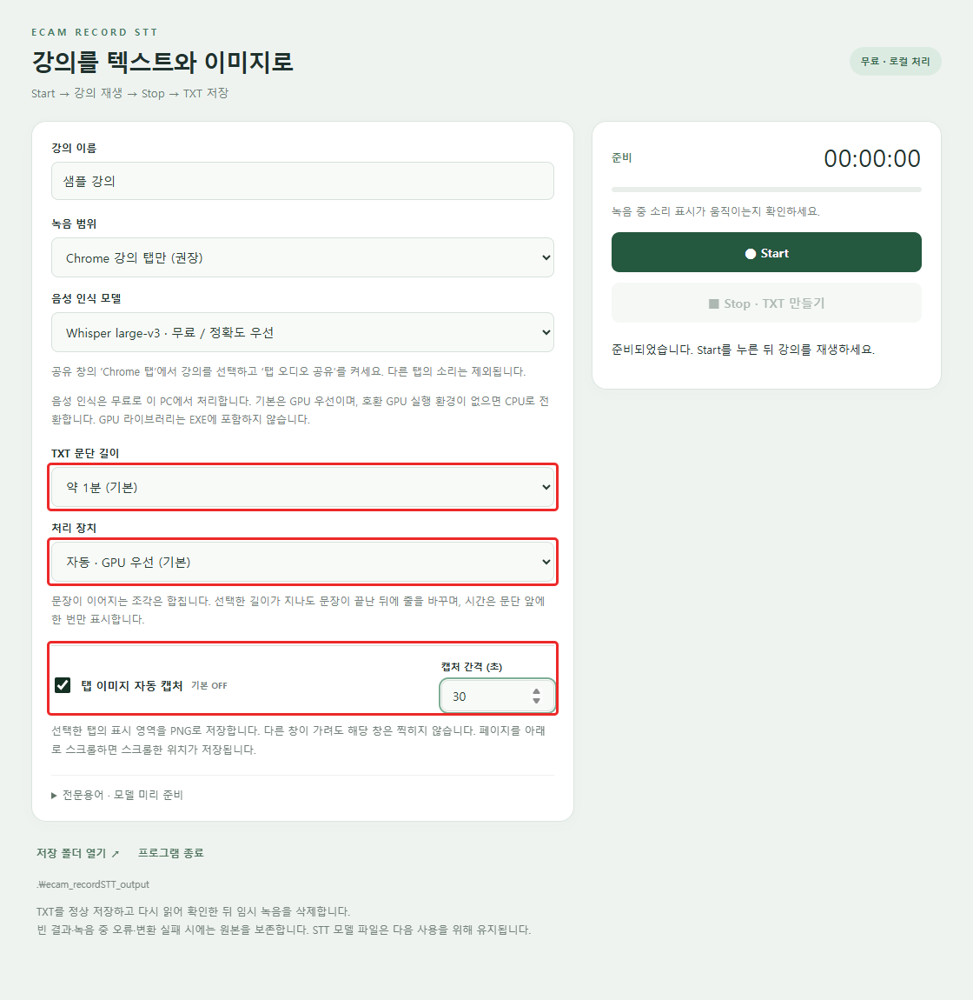
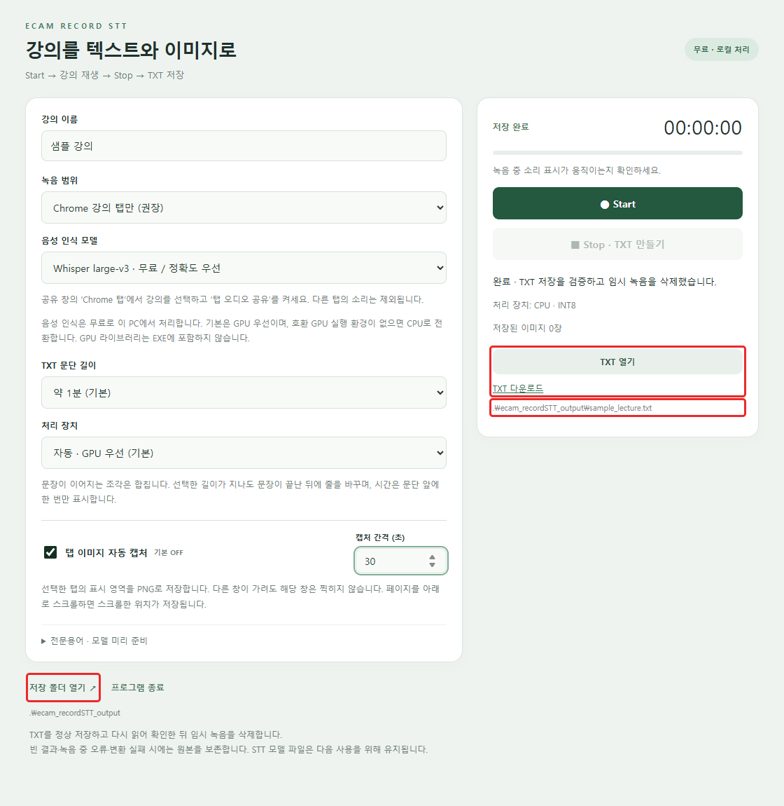

# ecam recordSTT

Chrome에서 재생하는 강의를 **무료 로컬 STT로 TXT에 저장**하는 Windows 프로그램입니다. 원하는 경우 같은 탭의 화면을 일정 간격으로 PNG에 저장합니다.

**[Windows EXE 다운로드](https://github.com/chickencoins/ecam-record-stt/releases/latest)**

## 실행 환경

- Windows 10/11 64비트, 최신 Chrome 또는 Edge
- EXE 하나로 실행합니다. CPU 실행에는 Python이나 별도 실행 환경을 설치할 필요가 없습니다.
- 처음 선택한 음성 인식 모델은 인터넷으로 자동 다운로드합니다. 이후에는 모델을 다시 받지 않고 로컬에서 전사합니다.
- 기본 처리 장치는 자동 · GPU 우선이며, GPU 라이브러리는 EXE에 포함하지 않습니다. 별도 호환 라이브러리가 없으면 CPU로 처리합니다.
- API 키, 유료 API, 구독은 필요하지 않습니다. 강의 음성과 캡처 이미지는 외부 전사 서버로 보내지 않습니다.

## 1. 녹음 시작

1. 원하는 폴더에 `ecam_recordSTT.exe`를 놓고 실행합니다.
2. 강의 이름을 입력합니다.
3. 녹음 범위를 **Chrome 강의 탭만**으로 선택합니다.
4. **Start**를 누릅니다.
5. 브라우저 공유 창의 **Chrome 탭**에서 강의 탭을 선택하고 **탭 오디오 공유**를 켭니다.
6. 프로그램에 **녹음 중**이 표시되면 강의를 재생합니다.



같은 브라우저의 다른 탭에서 재생되는 소리는 포함하지 않습니다. 마이크도 사용하지 않습니다. 탭 공유가 어려운 경우 **PC 기본 출력 장치의 모든 소리**를 선택할 수 있습니다. 이 모드에서는 다른 프로그램의 소리도 함께 녹음합니다.

## 2. 이미지 캡처와 문단 설정

이미지 캡처는 **기본 OFF**입니다. 필요한 경우 **탭 이미지 자동 캡처**를 켜고 **캡처 간격 (초)**에 1~3600 사이의 정수를 입력합니다. 기본 간격은 30초입니다.



- 캡처 대상은 선택한 탭의 **현재 표시 영역**입니다. 다른 창이 앞을 가려도 그 창은 이미지에 섞이지 않습니다.
- 다른 탭을 보거나 브라우저 창을 최소화해도 공유 스트림이 유지되는 동안 캡처를 계속합니다.
- 스크롤하면 스크롤한 위치가 찍힙니다. 스크롤 밖의 페이지 전체를 이어 붙이거나 영상 부분만 자동으로 잘라내지는 않습니다.
- 사이트가 백그라운드에서 영상을 일시 정지하거나 브라우저가 탭을 절전·폐기하면 새 화면이 제공되지 않을 수 있습니다. 캡처를 켠 채 사이트의 재생 상태를 확인하세요.
- 이미지는 공유 스트림의 프레임 크기로 저장합니다. 간격은 목표 주기이며 프레임 도착·저장 지연에 따라 실제 파일 이름의 초가 조금 달라질 수 있습니다.
- 이미지 캡처는 **Chrome 강의 탭만** 모드에서 지원합니다.

**TXT 문단 길이**는 기본 약 1분입니다. 짧게 나뉜 인식 결과를 이어 붙이고 문장 끝에서 문단을 나눕니다. 30초·1분·2분·5분을 선택하거나 짧은 인식 구간별 표시를 사용할 수 있습니다. 시간 표시는 문단 앞에 한 번만 넣습니다.

**처리 장치**는 `자동 · GPU 우선`이 기본입니다. NVIDIA 드라이버와 호환 CUDA 12 / cuDNN 9 실행 환경이 필요합니다. 별도 GPU DLL은 EXE 옆 `ecam_recordSTT_data/gpu`에서 자동으로 찾습니다. 이미 설치한 DLL은 `ECAM_GPU_DIR` 또는 `CUDA_PATH/bin`에서도 읽을 수 있습니다. GPU를 준비하지 못하거나 처리 중 오류가 발생하면 이유를 표시하고 CPU로 전환합니다. GPU가 있다는 것만으로 CUDA/cuDNN 라이브러리가 설치되어 있는 것은 아닙니다.

## 3. Stop과 결과 확인

강의가 끝나면 **Stop · TXT 만들기**를 누릅니다. 변환이 끝날 때까지 기다린 뒤 **TXT 열기** 또는 **저장 폴더 열기**를 누릅니다.



위 화면의 강의 이름과 파일 경로는 사용법 설명용 예시입니다.

결과는 항상 **EXE가 있는 폴더 아래의 `ecam_recordSTT_output`**에 저장합니다. 강의별 파일 이름에는 녹음 시각과 고유 식별자가 붙습니다.

```text
ecam_recordSTT.exe
ecam_recordSTT_output/
├─ sample_lecture_20261001_090000_a1b2c3d4.txt
└─ sample_lecture_20261001_090000_a1b2c3d4/
   ├─ 000000s.png
   ├─ 000030s.png
   └─ 000060s.png
```

이미지 폴더 이름은 TXT의 확장자를 제외한 이름과 같습니다. `000030s.png`는 **녹음 시작 후 30초**에 캡처한 이미지입니다. TXT의 시간도 영상 플레이어 시간이 아닌 녹음 시작 기준입니다. 캡처를 끈 경우 이미지 폴더를 만들지 않습니다.

TXT 예시:

```text
[00:00:11] 오늘은 첫 번째 예제에서 변수를 살펴보겠습니다. 이어서 배열을 만들고 그래프로 표현하겠습니다.

[00:01:14] 다음으로 축의 이름과 범례를 설정하겠습니다.
```

## 긴 강의와 파일 보존

- 2시간 분량도 음성을 디스크에 저장하고 약 4분 단위로 나눠 처리합니다. TXT 문단 길이와 내부 처리 단위는 별개입니다.
- 변환 속도는 모델·PC 성능·강의 내용에 따라 달라집니다. `large-v3`는 정확도 우선, `turbo`는 속도 우선 선택입니다.
- 인식된 내용은 요약하지 않습니다. 자동 전사에는 오인식이 있을 수 있으며, 전문용어 입력란에 용어를 지정할 수 있습니다.
- TXT를 저장하고 다시 읽어 내용이 일치하는지 확인한 후 해당 임시 음성과 중간 전사 파일을 삭제합니다. 사용자가 켠 PNG 캡처는 결과물이므로 남깁니다.
- 빈 전사 결과, 변환 실패, 녹음 중 연결 오류가 발생하면 원본을 보존합니다. 다음 실행에서 **보존된 녹음 → 다시 변환**으로 재시도할 수 있습니다.
- 녹음 중 오류가 있던 원본은 일부 구간이 누락됐을 가능성이 있으므로 전사 후에도 자동 삭제하지 않습니다.
- 모델과 복구 데이터는 EXE 옆 `ecam_recordSTT_data`에 저장합니다. `models`는 재사용할 모델, `pending`은 미완료 녹음, `gpu`는 선택적 GPU DLL입니다. 모델과 GPU DLL은 녹음 파일이 아니므로 유지합니다.
- 실행 환경 압축 해제도 `ecam_recordSTT_data/runtime`에서만 진행하고 정상 종료 후 정리합니다. 기타 임시 파일과 캐시도 이 데이터 폴더 아래에 둡니다. EXE 위치에 쓰기 권한이 없으면 외부로 우회 저장하지 않고 오류를 표시합니다.
- 위 저장 범위는 이 프로그램이 관리하는 파일 기준입니다. 기존 Chrome/Edge 프로필과 Windows가 자체 관리하는 기록은 해당 프로그램의 설정을 따릅니다.

## 소스에서 실행 / 빌드

Python 3.13 64비트 기준:

```powershell
python -m venv .venv
.\.venv\Scripts\python.exe -m pip install -r requirements.txt
.\.venv\Scripts\python.exe app.py
```

GPU 라이브러리를 제외한 단일 EXE 빌드:

```powershell
.\.venv\Scripts\python.exe build.py
```

결과: `dist/ecam_recordSTT.exe`. 모델 가중치는 실행 시 다운로드하므로 EXE에 포함하지 않습니다. CPU 실행 환경은 EXE에 포함되며 실행 시 임시 폴더에 자동으로 풀립니다. CUDA, cuDNN, cuBLAS 등 GPU DLL은 빌드에서 제외합니다. 첫 시작에는 잠시 시간이 걸릴 수 있습니다.

소스에서 선택적으로 GPU를 사용하려면 `requirements-gpu.txt`를 별도로 설치할 수 있습니다. 설치 여부와 관계없이 배포 EXE에는 GPU 라이브러리를 넣지 않습니다.

```powershell
.\.venv\Scripts\python.exe -m pip install -r requirements-dev.txt
.\.venv\Scripts\python.exe -m unittest discover -s tests -v
.\.venv\Scripts\python.exe tests/browser_capture.py
.\.venv\Scripts\python.exe tests/browser_capture.py --minimized
```

브라우저 통합 테스트는 샘플 탭을 사용하며 소리를 재생하지 않습니다.

## 라이선스와 구성 요소

프로젝트 코드는 [MIT License](LICENSE)입니다. 포함된 외부 라이브러리는 각각의 라이선스를 따릅니다. 빌드 시 외부 라이브러리 고지 파일을 EXE 안에 포함합니다.

- [faster-whisper](https://github.com/SYSTRAN/faster-whisper)
- [Whisper](https://github.com/openai/whisper)
- [CTranslate2](https://github.com/OpenNMT/CTranslate2)
- [PyAudioWPatch](https://github.com/s0d3s/PyAudioWPatch)
- [Chrome 화면 공유](https://developer.chrome.com/docs/web-platform/screen-sharing-controls/)
